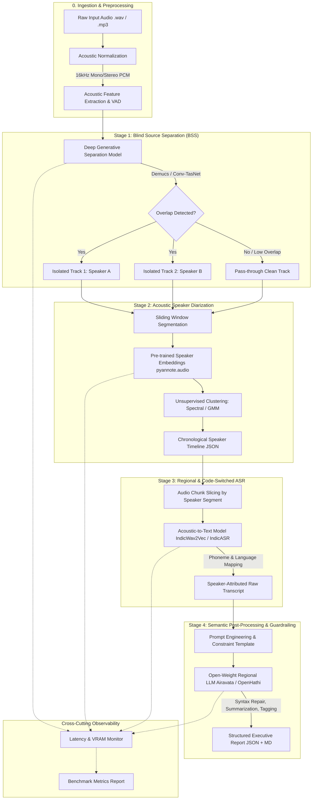

# 02 — System Architecture & Dataflow Design

## 1. Architectural Philosophy

The architecture of the **Advanced Computational Speech Engineering Pipeline** follows three core principles:
1. **Decoupled Modularity**: Each stage (BSS, Diarization, ASR, LLM) is encapsulated behind a strict Python interface. No stage makes implicit assumptions about internal model weights or proprietary vendor formats.
2. **Explicit Data Contracts**: All inter-stage communication relies on strongly-typed, schema-validated artifacts (audio paths, timestamp arrays, speaker assignment dictionaries, text transcripts).
3. **Resilience & Graceful Degradation**: Real-world acoustic data produces edge cases (e.g., zero speaker overlap, single-speaker monologues, inaudible murmurs). The pipeline incorporates fallback paths rather than catastrophic exceptions.

---

## 2. End-to-End System Pipeline Diagram



---

## 3. Detailed Data Contracts & Schemas

To ensure clean system integration, every stage adheres to explicit JSON data contracts.

### Contract 1: Ingestion & Normalization Metadata (`metadata.json`)
```json
{
  "source_file": "sample_broadcast_01.wav",
  "sample_rate_hz": 16000,
  "channels": 1,
  "duration_seconds": 184.50,
  "bit_depth": 16,
  "rms_energy_db": -22.4,
  "snr_estimate_db": 14.8
}
```

### Contract 2: Source Separation Output Manifest (`separation_manifest.json`)
```json
{
  "input_audio_path": "outputs/00_preprocessed/sample_broadcast_01.wav",
  "num_sources_detected": 2,
  "separation_model": "htdemucs_v4",
  "isolated_tracks": [
    {
      "source_index": 0,
      "track_path": "outputs/01_separated/sample_broadcast_01_source_0.wav",
      "energy_ratio": 0.58
    },
    {
      "source_index": 1,
      "track_path": "outputs/01_separated/sample_broadcast_01_source_1.wav",
      "energy_ratio": 0.42
    }
  ],
  "execution_time_seconds": 4.12
}
```

### Contract 3: Diarization Output Timeline (`diarization_timeline.json`)
```json
{
  "audio_file": "outputs/00_preprocessed/sample_broadcast_01.wav",
  "algorithm": "pyannote_embedding_spectral_clustering",
  "total_speakers_detected": 2,
  "segments": [
    {
      "segment_id": 0,
      "speaker_id": "SPEAKER_00",
      "start_time": 0.0,
      "end_time": 6.84,
      "confidence": 0.92
    },
    {
      "segment_id": 1,
      "speaker_id": "SPEAKER_01",
      "start_time": 7.10,
      "end_time": 14.32,
      "confidence": 0.88
    },
    {
      "segment_id": 2,
      "speaker_id": "SPEAKER_00",
      "start_time": 14.10,
      "end_time": 22.50,
      "confidence": 0.85
    }
  ]
}
```

### Contract 4: Raw ASR Output Transcript (`raw_transcript.json`)
```json
{
  "pipeline_stage": "ASR",
  "model_name": "ai4bharat/indicwav2vec_v1_hindi",
  "utterances": [
    {
      "utterance_id": 0,
      "speaker_id": "SPEAKER_00",
      "start_time": 0.0,
      "end_time": 6.84,
      "detected_language": "hi-en",
      "raw_text": "नमस्कार किसान भाइयों आज हम गेहूं के mandi rate की चर्चा करेंगे",
      "confidence_score": 0.89
    },
    {
      "utterance_id": 1,
      "speaker_id": "SPEAKER_01",
      "start_time": 7.10,
      "end_time": 14.32,
      "detected_language": "hi-en",
      "raw_text": "हां भाई साहब इस बार MSP से ऊपर price मिल रहा है private traders से",
      "confidence_score": 0.84
    }
  ]
}
```

### Contract 5: Final Post-Processed Semantic Report (`final_report.json`)
```json
{
  "metadata": {
    "audio_duration_seconds": 184.50,
    "speakers_identified": ["SPEAKER_00", "SPEAKER_01"],
    "primary_topics": ["Wheat MSP", "Agricultural Mandi Prices", "Private Procurement"],
    "language_mix": "Hindi-English Code-Switched (Hinglish)"
  },
  "executive_summary": "Two participants discuss current agricultural market dynamics for wheat in regional mandis. SPEAKER_00 introduces the session on grain pricing trends. SPEAKER_01 reports that local private traders are offering rates higher than the government-mandated Minimum Support Price (MSP), driving higher private sales.",
  "keyword_tags": ["#Agriculture", "#WheatMSP", "#MandiPrices", "#KisanDiscussion", "#GrainProcurement"],
  "key_findings": [
    {
      "topic": "Market Pricing",
      "detail": "Private traders offering prices above official MSP.",
      "speaker_attribution": "SPEAKER_01"
    }
  ],
  "speaker_separated_dialogue": [
    {
      "speaker": "SPEAKER_00",
      "timestamp": "00:00 - 00:06",
      "cleaned_text": "नमस्कार किसान भाइयों, आज हम गेहूं के मंडी रेट की चर्चा करेंगे।"
    },
    {
      "speaker": "SPEAKER_01",
      "timestamp": "00:07 - 00:14",
      "cleaned_text": "हाँ भाई साहब, इस बार MSP से ऊपर दाम मिल रहा है प्राइवेट व्यापारियों से।"
    }
  ]
}
```

---

## 4. Pipeline Fallback & Graceful Degradation Strategy

In noisy real-world speech engineering, upstream stages can produce degenerate outputs. The architecture incorporates deterministic fallbacks:

```
[Edge Case: Single Speaker Input]
  BSS outputs 1 dominant track + 1 near-silent residual
  --> Energy Ratio Detector flags track 2 as silence (energy < -45 dB)
  --> Pipeline routes single clean track to Diarization
  --> Diarizer assigns single cluster without artificial splitting

[Edge Case: Inaudible / Extreme Noise Segment]
  ASR yields empty string or confidence < 0.20
  --> Token Validator tags segment as "[Unintelligible / Noise Drop]"
  --> LLM prompt includes explicit directive: "Do not guess unintelligible tokens; preserve placeholder tags"

[Edge Case: High Code-Switching Confusion]
  Phonetic tokens mixed across Devanagari and Latin
  --> Pre-LLM Normalizer harmonizes script representation
  --> LLM performs semantic normalization while preserving bilingual intent
```

---

## 5. Repository & Codebase Architecture

```
advanced-speech-pipeline/
├── README.md                      # Project overview, quickstart, and reproduction steps
├── requirements.txt               # Pinned Python dependencies
├── setup.py                       # Installable package configuration
├── configs/
│   ├── default_config.yaml        # Main pipeline execution config
│   ├── bss_demucs.yaml            # Separation model hyperparameters
│   ├── diarization.yaml           # Diarization thresholds, window size, clustering params
│   ├── asr_indic.yaml             # ASR model checkpoints, language codes, decoding params
│   └── llm_guardrails.yaml        # Prompt templates, temperature, structured schema
├── data/
│   ├── raw_samples/               # Real-world Indian audio snippets (AIR, Vaani, etc.)
│   ├── controlled_mixtures/       # Synthetic overlapping mixtures with ground truth
│   ├── metadata/                  # Annotation manifests, speaker labels, transcripts
│   └── cache/                     # Intermediate wave/tensor cache (git-ignored)
├── src/
│   ├── __init__.py
│   ├── core/
│   │   ├── base_module.py         # Abstract base class for all pipeline stages
│   │   └── state.py               # Immutable pipeline state / context container
│   ├── preprocessing/
│   │   ├── normalizer.py          # Audio resampling (16kHz), mono conversion, peak normalizer
│   │   └── vad.py                 # Voice Activity Detection (Silero VAD / WebRTCVAD)
│   ├── separation/
│   │   ├── demucs_wrapper.py      # Meta Demucs inference wrapper
│   │   └── conv_tasnet_wrapper.py # Conv-TasNet comparison implementation
│   ├── diarization/
│   │   ├── embedder.py            # pyannote.audio speaker embedding extractor
│   │   └── clusterer.py           # Spectral Clustering & GMM implementations with auto-k
│   ├── asr/
│   │   ├── indic_asr_engine.py    # IndicWav2Vec / IndicASR inference handler
│   │   └── whisper_baseline.py    # Vanilla Whisper baseline comparator
│   ├── llm/
│   │   ├── prompt_builder.py      # Structured prompt templates with guardrail constraints
│   │   └── indic_llm_engine.py    # Airavata / OpenHathi / Local LLM inference wrapper
│   └── pipeline.py                # Master Pipeline orchestrator (CLI & programmatic API)
├── evaluation/
│   ├── bss_metrics.py             # SI-SDR, SDR, SIR, SAR with Permutation Invariant Training
│   ├── diarization_metrics.py     # Diarization Error Rate (DER), Jaccard Error Rate (JER)
│   ├── asr_metrics.py             # WER, CER, Mixed-Language Error Rate (MER)
│   ├── llm_metrics.py             # ROUGE-L, BERTScore, Hallucination checks
│   └── error_cascade.py           # Cross-stage error propagation tracking script
├── notebooks/
│   ├── 01_system_benchmark.ipynb  # Authoritative latency, RAM, VRAM benchmark notebook
│   ├── 02_separation_analysis.ipynb # SI-SDR comparison and spectrogram visualizations
│   ├── 03_diarization_ablation.ipynb # Spectral vs GMM clustering ablation
│   └── 04_error_propagation_study.ipynb # Cascade analysis across varying SNR/overlap
├── tests/
│   ├── test_preprocessing.py      # Unit tests for audio normalization & formatting
│   ├── test_separation.py         # Unit tests for BSS output shapes and energy bounds
│   ├── test_diarization.py        # Unit tests for timeline continuity and schema
│   ├── test_asr.py                # Unit tests for transcript mapping and speaker alignment
│   └── test_pipeline_integration.py # End-to-end integration test on synthetic sample
├── outputs/                       # Auto-generated experiment runs and reports
└── docs/                          # Architecture guides, API reference, benchmark charts
```
