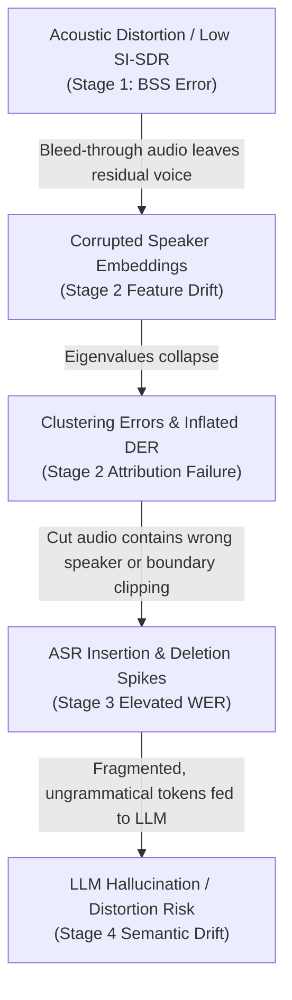

# 08 — Comprehensive Evaluation Strategy & Error Cascading Framework

## 1. Engineering Philosophy: Build $\rightarrow$ Measure $\rightarrow$ Compare $\rightarrow$ Analyze $\rightarrow$ Improve

A major flaw in naive machine learning projects is assembling multiple pre-trained models and claiming success solely based on qualitative impressions of a single test file. 

This project adheres to rigorous empirical validation:
* **No component is included without quantitative justification**: We mathematically demonstrate that each stage improves downstream accuracy compared to simpler baselines.
* **Dual-Track Evaluation**: Controlled synthetic benchmarks provide exact mathematical metrics; real-world radio recordings demonstrate domain robustness.
* **Formal Error Cascading Analysis**: We trace and quantify how degradation at early acoustic stages propagates through intermediate representations to the final output.

---

## 2. Multi-Stage Metric Summary Table

| Stage | Input Representation | Output Representation | Primary Architecture | Metric(s) | Baseline Comparator | Failure Mode Captured |
|---|---|---|---|---|---|---|
| **Stage 1: BSS** | Mixed Audio Waveform ($\mathbf{x} \in \mathbb{R}^N$) | Isolated Source Waveforms ($\hat{\mathbf{s}}_i \in \mathbb{R}^N$) | Meta's Demucs (`htdemucs`) | **SI-SDR** (dB), **SDR** (dB), **SIR** (dB) via PIT | Raw Mixed Audio (SI-SDR = 0 dB relative to mix) | Permutation confusion, musical phase artifacts, energy suppression |
| **Stage 2: Diarization** | Isolated / Mixed Waveforms | Timestamped Timeline JSON ($[t_s, t_e] \rightarrow C_k$) | `pyannote.audio` + Spectral Clustering | **DER** (Missed + False Alarm + Confusion %), **JER** (%) | Direct Diarization on unseparated raw mixture | Speaker confusion during overlapping talk, oversegmentation |
| **Stage 3: ASR** | Speaker-segmented audio cuts | Phonetic / Script Utterance JSON | AI4Bharat `IndicWav2Vec` / `IndicASR` | **WER** (%), **CER** (%), Mixed-Language Token Error Rate | Vanilla OpenAI Whisper (`whisper-base`) | Word omission during code-switching, Devanagari matra errors, hallucinated repeats |
| **Stage 4: LLM** | Speaker-attributed raw transcript | Structured Report JSON + MD | Localized Foundational LLM (`Airavata` / `OpenHathi`) | **Hallucination Rate** (%), **ROUGE-L**, **BERTScore** | Zero-shot unconstrained LLM prompt (no guardrails) | Fact invention, price hallucination, speaker role mixing |

---

## 3. Progressive Ablation & Pipeline Comparison Strategy

To prove the incremental value of each architectural stage, we evaluate four explicit pipeline configurations across an identical test suite:

```
[Pipeline A: Naive Baseline]
  Raw Audio ─────────────────────────────────────────────────────────────> ASR ──────> Raw Text
  (Hypothesis: Catastrophic WER due to overlapping speech and code-switching failures)

[Pipeline B: Separation-Only Ablation]
  Raw Audio ──> Separation (BSS) ─────────────────────────────────────────> ASR ──────> Independent Track Transcripts
  (Hypothesis: Eliminates acoustic overlap interference, but lacks chronological conversational timeline)

[Pipeline C: Traditional Pipeline]
  Raw Audio ──> Separation (BSS) ──> Diarization ─────────────────────────> ASR ──────> Speaker-Attributed Transcript
  (Hypothesis: Full "Who Spoke What and When" timeline, but raw transcript remains noisy and uncurated)

[Pipeline D: Full Proposed Pipeline]
  Raw Audio ──> Separation ──> Diarization ──> Regional ASR ──> Guardrailed LLM ──────> Executive Structured Report
  (Hypothesis: Maximum factual clarity, zero overlap distortion, structured domain intelligence)
```

### Quantitative Ablation Comparison Matrix
During milestone execution, this matrix will be populated with empirical measurements:

| Pipeline Configuration | Stage 1 SI-SDR (dB) | Stage 2 DER (%) | Stage 3 WER (%) | Stage 4 Hallucination (%) | End-to-End Latency (s) |
|---|---|---|---|---|---|
| **Pipeline A** (Raw $\rightarrow$ ASR) | N/A | N/A | *Measured* | N/A | *Measured* |
| **Pipeline B** (BSS $\rightarrow$ ASR) | *Measured* | N/A | *Measured* | N/A | *Measured* |
| **Pipeline C** (BSS $\rightarrow$ Diarize $\rightarrow$ ASR) | *Measured* | *Measured* | *Measured* | N/A | *Measured* |
| **Pipeline D** (Full System) | *Measured* | *Measured* | *Measured* | *Measured* | *Measured* |

---

## 4. Formal Error Cascading Analysis

A signature engineering contribution of this project is the study of **error propagation**. In a sequential pipeline, errors do not remain isolated; they cascade and amplify.



### The Error Cascade Experiment Protocol
To quantify this phenomenon scientifically:
1. We take a controlled mixture with high overlap ($\Omega = 50\%$).
2. We artificially degrade Stage 1 separation quality by scaling noise injection ($\text{SNR} = 20\text{ dB} \rightarrow 10\text{ dB} \rightarrow 0\text{ dB}$).
3. We plot three coupled curves:
   - **X-Axis**: Stage 1 Output SI-SDR ($\text{dB}$)
   - **Y-Axis 1**: Stage 2 Diarization Error Rate ($\text{DER } \%$)
   - **Y-Axis 2**: Stage 3 Word Error Rate ($\text{WER } \%$)
   - **Y-Axis 3**: Stage 4 Hallucination / Entity Grounding Rate ($\%$)
4. **Key Engineering Finding**: Identify the *critical acoustic threshold* below which downstream semantic extraction collapses.

---

## 5. Failure Case Taxonomy & Root Cause Analysis

Every stage maintains an explicit failure log documenting anomalous behaviors:

| Stage | Observable Failure Phenomenon | Acoustic / Algorithmic Root Cause | Mitigation / Fallback Implemented |
|---|---|---|---|
| **BSS** | "Musical noise" (chirping phase artifacts) in separated tracks. | STFT phase inconsistency in hybrid U-Net masking. | Apply Wiener filtering post-masking and energy floor thresholding. |
| **BSS** | Ghost / Phantom Voice channel (silent speaker split into two). | Model over-allocates sources when energy imbalance is high. | RMS energy gating ($<-40\text{ dB}$ relative to peak flags track as inactive). |
| **Diarization** | Speaker Ping-Ponging (rapid alternating labels on single speaker). | Sliding window too short ($<1.0\text{ s}$) or embedding drift across pitch variations. | Temporal boundary smoothing and minimum segment length constraint ($1.2\text{ s}$). |
| **ASR** | Language Repetition Loop (repeating the same word indefinitely). | CTC decoding collapse on long silence or background static. | Voice activity segmentation trimming silence before ASR forward pass. |
| **ASR** | Devanagari Halant / Matra Mismatch. | Character encoding divergence between reference and model vocabulary. | Strict Unicode NFKC normalization prior to WER calculation. |
| **LLM** | Price / Quantity Hallucination. | Model attempts to fill in context on fragmented sentences. | Negative prompt guardrails + automated entity grounding verification. |
